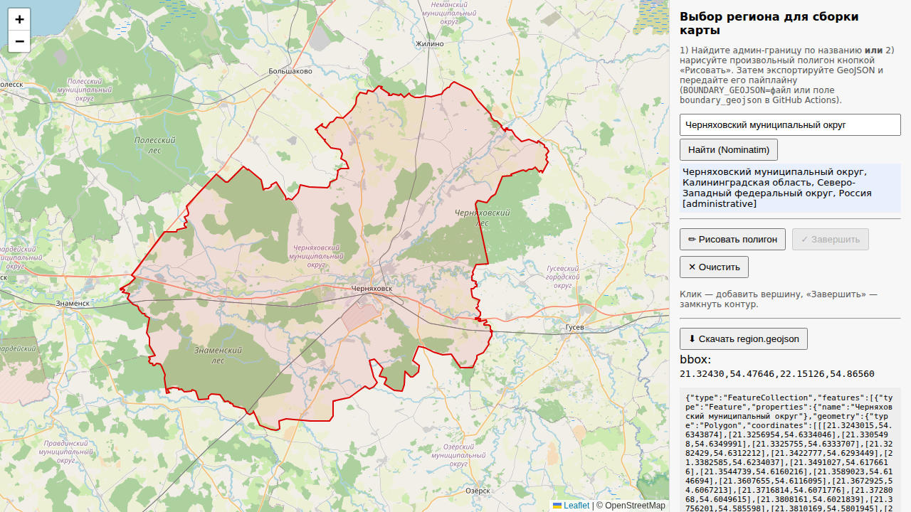

# garmin-custom-map

Карты для навигаторов **Garmin GPSMAP 62/64/65/66/67** (и любых других,
понимающих `gmapsupp.img`) в стиле [opentopomap.org](https://opentopomap.org).

В одном файле — три слоя, каждый включается и выключается на приборе
независимо (**Setup → Map → Map Information**):

1. **Топооснова** — OpenStreetMap в оформлении OpenTopoMap, с маршрутизацией
   и адресным поиском, подписи на русском;
2. **Горизонтали** — рельеф из SRTM, шаг 10 м (подписи в метрах);
3. **Кадастр** *(опционально)* — границы земельных участков Росреестра
   с кадастровыми номерами.

---

## Скачать готовую карту

Готовые карты по федеральным округам РФ и сопредельным странам (Беларусь,
Украина, Молдавия, Литва, Латвия, Эстония, Грузия, Армения, Азербайджан,
Казахстан, Узбекистан, Таджикистан, Киргизия, Монголия) собираются
автоматически раз в два месяца и публикуются в
**[Releases](../../releases)** — берите последний релиз `maps-ГГГГ-ММ-ДД`.
У зарубежных стран кадастрового слоя нет (данные Росреестра — только по РФ).

**Установка:**

1. Скачайте `<регион>_gmapsupp.img` нужного региона. Если карта большая
   и разбита на части (`<регион>_gmapsupp.part1.img`, `part2`, …) —
   скачайте **все части**: вместе они образуют полную карту.
2. Скопируйте файл(ы) на карту памяти прибора в папку `Garmin/`
   (имена можно не менять — прибор подхватывает любые `.img`).
3. Включите нужные слои: **Setup → Map → Map Information** — там будут
   отдельные пункты «Топооснова …», «Горизонтали …» и, если есть,
   «Кадастр …».

> ⚠ Стиль OpenTopoMap распространяется по лицензии **CC-BY-NC-SA** —
> карты можно использовать только в некоммерческих целях.

---

## Собрать карту самому

Можно собрать карту любого региона: страна, область, район или произвольная
нарисованная на карте территория.

### Вариант 1: Docker (Windows / macOS / Linux)

Нужен только [Docker](https://www.docker.com/products/docker-desktop/).

```bash
# Linux / macOS / Git Bash / WSL
./docker-run.sh --config config/examples/test-chernyakhovsk.env
```

```powershell
# Windows PowerShell
.\docker-run.ps1 --config config/examples/test-chernyakhovsk.env
```

Первый запуск соберёт образ с тулчейном (~5 мин), дальше — только сборка
карты. Результат: `out/<регион>/<регион>_gmapsupp.img`.

### Вариант 2: без Docker (Linux / WSL)

```bash
sudo apt install openjdk-21-jre-headless osmium-tool aria2 python3-pip
pip install pyhgtmap
./run_all.sh --config config/examples/test-chernyakhovsk.env
```

mkgmap/splitter и стиль OpenTopoMap скачаются автоматически при первом
запуске.

### Как задать свой регион

Скопируйте `config/examples/test-chernyakhovsk.env` и поменяйте значения —
или передайте переменные напрямую:

```bash
REGION_NAME=suzdal \
REGION_QUERY="Суздальский район" \
GEOFABRIK=central-fd \
./docker-run.sh
```

| Переменная | Что делает |
|---|---|
| `REGION_NAME` | имя региона → имя файла карты |
| `REGION_QUERY` | название региона — берётся **реальная административная граница** (Nominatim/OSM) |
| `BBOX=з,ю,в,с` | прямоугольник вместо названия |
| `BOUNDARY_GEOJSON=файл` | произвольная область (см. ниже) |
| `GEOFABRIK` | откуда брать OSM-данные: `central-fd`, `volga-fd`, `kaliningrad`, … — список в `config/geofabrik_sources.yaml`. Если регион не задан вообще — соберётся весь экстракт |
| `CONTOUR_STEP` | шаг горизонталей в метрах (10 по умолчанию) |
| `INCLUDE_CADASTRE=1` | добавить кадастровый слой |
| `CADASTRE_GEOJSON=файл` | готовая выгрузка участков (см. ниже) |
| `WITH_DEM=0` | отключить встроенную карту высот (отмывка/профиль; по умолчанию включена) |
| `WITH_SEA=1` | корректные моря/побережья (скачает ~800 МБ) |
| `WITH_BOUNDS=1` | адресный поиск (скачает ~400 МБ) |

### Нарисовать регион на карте

Откройте `webgui/index.html` в браузере (просто двойной клик, сервер не
нужен): поиск по названию, рисование произвольного полигона, экспорт в
`region.geojson`.



Затем:

```bash
REGION_NAME=myarea BOUNDARY_GEOJSON=region.geojson GEOFABRIK=central-fd ./docker-run.sh
```

### Кадастровый слой

Публичная кадастровая карта (nspd.gov.ru) **не открывается из-за рубежа**,
поэтому надёжнее всего готовая выгрузка:

1. Выгрузите участки своего района в GeoJSON через QGIS с плагином
   «NGQ Rosreestr Tools» — пошагово в [cadastre/README.md](cadastre/README.md).
2. Соберите карту с `INCLUDE_CADASTRE=1 CADASTRE_GEOJSON=cadastre/мой-район.geojson`.

С российского IP работает и прямая выгрузка: просто `INCLUDE_CADASTRE=1`
без `CADASTRE_GEOJSON` (скрипт сам скачает участки по границе региона с
ретраями и паузами). Если кадастр скачать не удалось, карта всё равно
соберётся — из двух слоёв.

---

## Совместимые устройства

Карты — в стандартном формате `gmapsupp.img` (mkgmap), работают на всех
Garmin с поддержкой загружаемых карт
([полный список в OSM wiki](https://wiki.openstreetmap.org/wiki/OSM_Map_On_Garmin)):

| Класс | Модели |
|---|---|
| **Туристические навигаторы** (основная цель) | GPSMAP 62 / 64 / 65 / 66 / 67; eTrex 20/30, 22x/32x, Touch 25/35, SE, Solar; Oregon 4xx–7xx; Montana 6xx/7xx; Dakota 10/20; GPSMAP 60CSx/76 (старые — см. примечание) |
| **Охотничьи** | Alpha, Astro |
| **Велокомпьютеры** | Edge Touring, 530/540, 830/840, 1000/1030/1040, Edge Explore |
| **Часы с картографией** | fenix 5X / 5 Plus / 6 Pro / 7 / 8, epix (Gen 2), Enduro 2/3, MARQ, Forerunner 945/955/965 — файл кладётся в папку `GARMIN` на часах |
| **Автомобильные** | nüvi, zūmo (формат поддерживается, но стиль карты — топографический, не для автонавигации) |

Примечания:

* **Старые приборы** (GPSMAP 60CSx, eTrex Legend/Vista, nüvi 1xxx):
  файл должен называться строго `gmapsupp.img` и лежать в `Garmin/`
  на карте памяти; поддерживается только один такой файл.
* **Не подходят**: устройства без поддержки карт — eTrex 10,
  Forerunner младше 945, Edge 130 и подобные.
* **Три слоя как отдельные карты** (Map Information) видят все
  современные модели (GPSMAP 62+, eTrex 20+, Oregon, Montana, Edge,
  часы); на старых слои отображаются все сразу.
* **Кириллица**: подписи в CP1251 — нужна прошивка с поддержкой
  русского языка (на «русских» и мультиязычных ревизиях всё
  отображается корректно).

## Частые вопросы

**Карта не появилась на приборе.** Проверьте, что файл лежит в папке
`Garmin/` на карте памяти и имеет расширение `.img`. На старых приборах
(62/64) файл должен называться строго `gmapsupp.img`.

**Слои не переключаются по отдельности.** Убедитесь, что смотрите
Setup → Map → Map Information: там должно быть три отдельных пункта.

**Кириллица квадратиками.** Карты собраны в кодировке CP1251 — на
GPSMAP 6x с прошивкой, поддерживающей русский язык, всё отображается;
выберите русский язык интерфейса.

**Хочу собрать регион, которого нет в списке Geofabrik.** Задайте
`GEOFABRIK` полным URL любого экстракта с
[download.geofabrik.de](https://download.geofabrik.de/) — граница региона
всё равно вырежется точно.

**Есть ли карта высот (отмывка рельефа, профиль высоты)?** Да, DEM
встроен в слой топоосновы: прибор показывает отмывку рельефа, высоту в
точке и профиль маршрута (Setup → Map → включите Shaded Relief /
«Отмывка»). Отключается при сборке `WITH_DEM=0`.

**Работает ли поиск по адресам?** Да: в карту зашиты поисковые индексы
(города, улицы, номера домов из OSM) — на приборе Меню → Поиск →
Адреса/Города. В готовых релизах это включено; при самостоятельной сборке
для лучшей привязки улиц к населённым пунктам добавьте `WITH_BOUNDS=1`
(скачает ~400 МБ предвычисленных границ).

---

## Донаты
USDT (ETH Network) 0xb7E5A7014C75a0edCb502d216EA9944ddC27f291 
USDT (TRX Network) TEzk4C4SNPdCihgpvBU2adcrUTHBD9Gj8S 
USDT (BSC Network) 0xb7E5A7014C75a0edCb502d216EA9944ddC27f291
BTC bc1qyag2vjdglf3lhjy24p7k6k77yxzjys6jw75f9c
ETH (ETH Network) 0xb7E5A7014C75a0edCb502d216EA9944ddC27f291

## Лицензии

* Данные карт: © участники [OpenStreetMap](https://www.openstreetmap.org/copyright) (ODbL), экстракты [Geofabrik](https://download.geofabrik.de/).
* Стиль: [OpenTopoMap](https://github.com/der-stefan/OpenTopoMap), **CC-BY-NC-SA 4.0** — некоммерческое использование.
* Рельеф: [viewfinderpanoramas.org](http://viewfinderpanoramas.org/) (Jonathan de Ferranti), SRTM.
* Кадастр: данные ПКК Росреестра; справочно, не является юридическим документом.

---

Разработчикам — архитектура пайплайна, GitHub Actions, отладка и известные
грабли: **[docs/DEVELOPMENT.md](docs/DEVELOPMENT.md)**.
